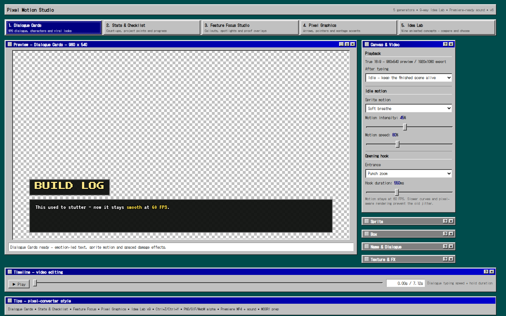
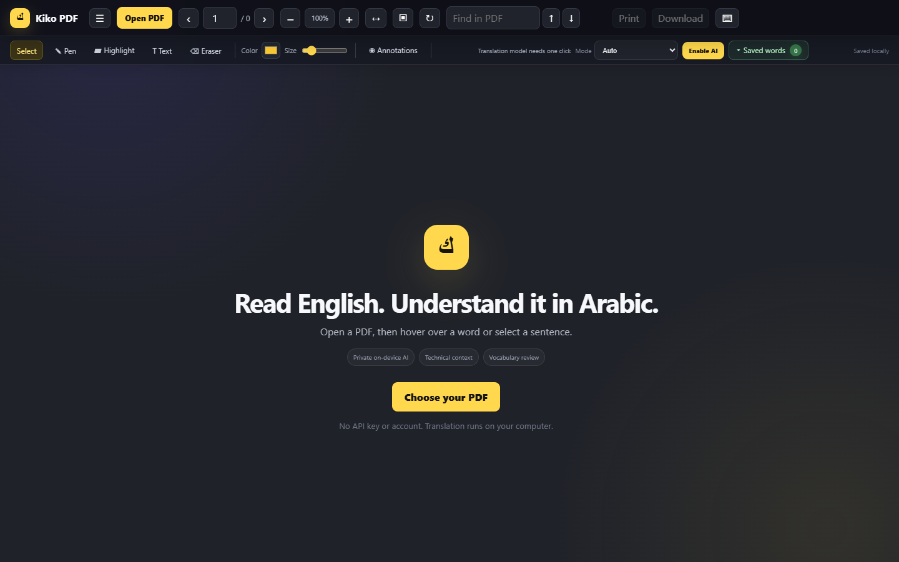

<div align="center">

# Tools I Wished Existed

### Two everyday frustrations that grew into two complete browser projects.

[](https://kikoesam.github.io/ai-portfolio-projects/)
[](https://developer.mozilla.org/docs/Web/JavaScript)
[](#privacy-by-design)

**I did not begin with a portfolio checklist. I began with two things that kept interrupting my work:**
making better motion graphics for my videos and understanding *C++ Primer* without breaking my reading flow.

</div>

---

## Choose a project

| | Project | The problem it solves | Try it |
|---|---|---|---|
| 🎞️ | **Pixel Motion Studio** | Turns text and ideas into interactive, export-ready motion graphics. | **[Launch the studio →](https://kikoesam.github.io/ai-portfolio-projects/pixel-motion-studio/)** |
| 📖 | **Kiko PDF Translator** | Makes technical English PDFs easier to study in Arabic without losing context. | **[Open the reader →](https://kikoesam.github.io/ai-portfolio-projects/kiko-pdf-reader/)** |

> [!IMPORTANT]
> This is **one portfolio repository containing two real projects**. The folders `kiko-pdf-reader/` and `pixel-motion-studio/` contain the actual applications. The older `document-reader/` and `youtube-studio/` paths are still present only as compatibility redirects to the real projects.

---

## 🎞️ Pixel Motion Studio

[](https://kikoesam.github.io/ai-portfolio-projects/pixel-motion-studio/)

### Why I built it

I wanted a text-based GIF maker for my YouTube videos—something that could turn an explanation into a small visual moment and make the video feel more alive. The first version was rigid, non-responsive, and difficult to interact with. It also had export and usability problems.

An AI-assisted experiment produced a small starting version, but it was not the finished idea I had in mind. I kept redesigning the interaction, expanding the visual system, and solving the export problems until the simple GIF maker became a complete motion-graphics workspace.

### What it became

```text
text-based GIF idea
        ↓
interactive dialogue cards
        ↓
five motion-graphics generators
        ↓
one export-ready studio for video creation
```

- **Five focused workspaces:** Dialogue Cards, Stats & Checklist, Feature Focus, Pixel Graphics, and Idea Lab.
- **Nine Idea Lab concepts** for exploring transitions, chapter intros, achievements, reaction cards, and more.
- A live **16:9 canvas**, motion controls, timeline scrubbing, autosave, undo, and redo.
- Transparent **PNG, GIF, and WebM** export.
- **MP4 with synchronized sound** and a Premiere-friendly green-screen workflow.
- Adaptive safe GIF export designed to avoid browser freezes on large animations.
- A MOGRT preparation pack for continuing the workflow in Adobe tools.

<p align="center">
  <a href="https://kikoesam.github.io/ai-portfolio-projects/pixel-motion-studio/"><strong>▶ Launch Pixel Motion Studio</strong></a>
  ·
  <a href="./pixel-motion-studio/"><strong>Browse its source</strong></a>
</p>

<details>
<summary><strong>What I learned while building it</strong></summary>

- Rendering responsive motion on an HTML canvas.
- Keeping animation timing consistent between preview and export.
- Managing transparent media formats and browser codec limitations.
- Designing one interface for several creative workflows without hiding the important controls.
- Treating AI output as an early draft that still needs product decisions, testing, and iteration.

</details>

---

## 📖 Kiko PDF Translator

[](https://kikoesam.github.io/ai-portfolio-projects/kiko-pdf-reader/)

### Why I built it

While studying *C++ Primer*, I wanted to hover over an English word and understand it immediately in Arabic. The available workflow did not work reliably for the way I studied, and switching between a PDF and a separate translator kept breaking my concentration.

So I built the reader I needed: a Chrome extension that translates inside the PDF, uses the surrounding paragraph to preserve meaning, and recognizes when the text contains important C++ terminology. From there, it grew into a complete study workspace with Primer-aware concepts, vocabulary review, annotations, progress tracking, and interactive quizzes.

### The study loop

```text
read the PDF → hover or select → understand in context
      ↑                                  ↓
review vocabulary ← answer a quick quiz ← connect the C++ concept
```

- **Hover translation** for words and selection translation for sentences.
- Chrome's **on-device English-to-Arabic translation**—no developer API key or remote account required.
- Context-aware explanations that use the surrounding paragraph instead of translating an isolated word blindly.
- Detection and explanation of important **C++ terms** inside the selected passage.
- A searchable map of *C++ Primer* concepts, chapters, and numbered subsections.
- **Quick quizzes** with revealable answers after a study section.
- Saved vocabulary, pronunciation, CSV export, JSON backup, and spaced review.
- Continuous PDF scrolling, exact search, zoom, rotation, annotations, undo/redo, printing, and annotated PDF export.

<p align="center">
  <a href="https://kikoesam.github.io/ai-portfolio-projects/kiko-pdf-reader/"><strong>▶ Try the web version</strong></a>
  ·
  <a href="./kiko-pdf-reader/Kiko-PDF-Translator-v3.0.3.zip"><strong>Download the Chrome extension</strong></a>
  ·
  <a href="./kiko-pdf-reader/"><strong>Browse its source</strong></a>
</p>

<details>
<summary><strong>Install the Chrome extension</strong></summary>

1. Download and extract `Kiko-PDF-Translator-v3.0.3.zip`.
2. Open `chrome://extensions` in Google Chrome.
3. Enable **Developer mode**.
4. Choose **Load unpacked**.
5. Select the extracted extension folder.

Chrome 151 or newer is recommended for the built-in translation model. Text-based PDFs are supported; scanned image PDFs require OCR and are outside the current version.

</details>

<details>
<summary><strong>What I learned while building it</strong></summary>

- Building a Manifest V3 Chrome extension and automatic PDF handling.
- Working with PDF.js, text layers, long-document virtualization, and annotation coordinates.
- Combining local AI translation with deterministic C++ concept data.
- Designing a study system around context, recall, and spaced vocabulary review.
- Keeping private study material on the user's device.

</details>

---

## Privacy by design

Kiko PDF Translator is local-first. PDFs, annotations, selected text, and saved vocabulary are not sent to a developer-operated server. Translation uses Chrome's on-device capabilities when available. See the [privacy summary](./kiko-pdf-reader/PRIVACY.md) for details.

Pixel Motion Studio also runs directly in the browser. Project settings are stored locally, and exports are generated on the user's device.

---

## Repository map

```text
ai-portfolio-projects/
├── kiko-pdf-reader/          # The real PDF reader and Chrome extension
├── pixel-motion-studio/      # The real five-workspace motion studio
├── assets/                   # README preview images
├── document-reader/          # Legacy redirect → kiko-pdf-reader
├── youtube-studio/           # Legacy redirect → pixel-motion-studio
└── index.html                # Portfolio landing page
```

## Built with

`JavaScript` · `HTML` · `CSS` · `Canvas API` · `PDF.js` · `pdf-lib` · `Chrome Extension APIs` · `Chrome Translator AI` · `Web Audio API` · `MediaRecorder`

---

<div align="center">

### Built because I needed the tools. Kept building because the first version was not enough.

[Explore both projects](https://kikoesam.github.io/ai-portfolio-projects/) · [Visit my GitHub profile](https://github.com/Kikoesam)

</div>
